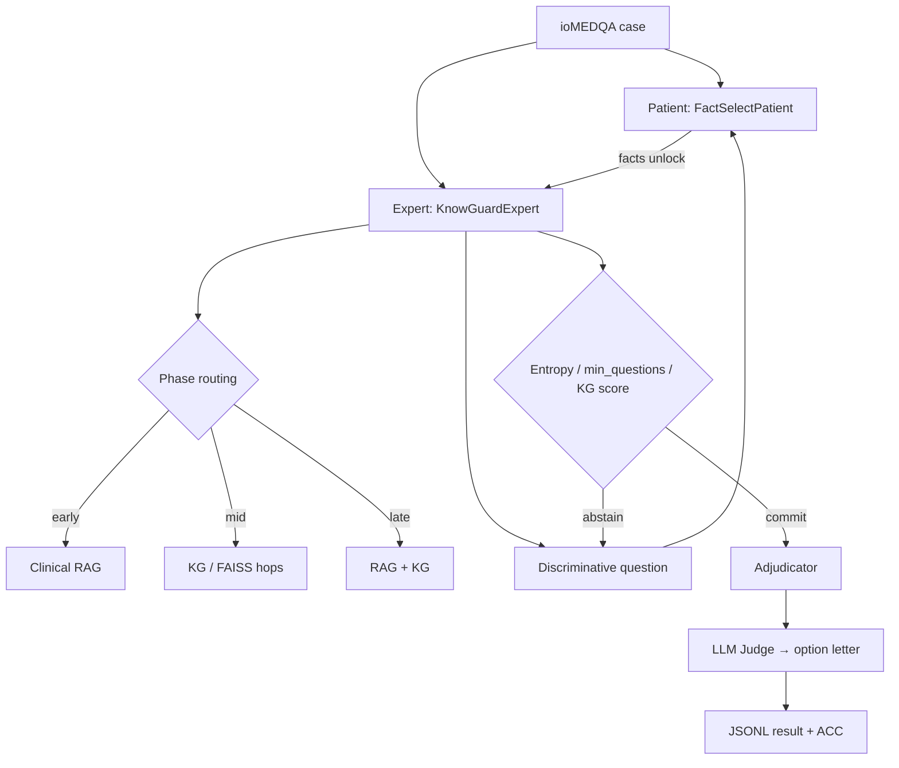

# KnowGuard — Research Stack, Codebase & Results (Presentation Guide)

**Paper:** *KnowGuard: Knowledge-Driven Abstention for Multi-Round Clinical Reasoning* (ICLR 2026)  
**arXiv:** [2509.24816](https://arxiv.org/abs/2509.24816)  
**Upstream:** [IcecreamArtist/KnowGuard](https://github.com/IcecreamArtist/KnowGuard)  
**This fork:** free/local + NVIDIA NIM / multi-provider evaluation stack aimed at beating the paper on **interactive ioMEDQA**.

> **Snapshot date:** 2026-09-04 (IST)  
> **Headline (partial full run):** **71.4% ACC on N=587 / 1272** interactive ioMEDQA cases — already **above** the paper’s basic KnowGuard **70.98%**, with the full N=1272 still running.

---

## Table of contents

1. [One-minute pitch](#1-one-minute-pitch)
2. [Paper baselines (what we try to beat)](#2-paper-baselines-what-we-try-to-beat)
3. [Latest results (all tables)](#3-latest-results-all-tables)
4. [What we built (A\* / research stack)](#4-what-we-built-a--research-stack)
5. [How we got these numbers (campaign history)](#5-how-we-got-these-numbers-campaign-history)
6. [Models & providers used](#6-models--providers-used)
7. [Datasets & where they live](#7-datasets--where-they-live)
8. [Knowledge graph & RAG artifacts](#8-knowledge-graph--rag-artifacts)
9. [Codebase structure (high level)](#9-codebase-structure-high-level)
10. [System architecture](#10-system-architecture)
11. [Module reference](#11-module-reference)
12. [How to run](#12-how-to-run)
13. [Ops lessons (429s, resume, hybrid)](#13-ops-lessons-429s-resume-hybrid)
14. [Honest limitations & next steps](#14-honest-limitations--next-steps)
15. [Presentation talking points](#15-presentation-talking-points)
16. [Citation](#16-citation)

---

## 1. One-minute pitch

KnowGuard is an **interactive clinical QA** system: the model only sees age / gender / chief complaint at first, must **ask questions**, retrieve knowledge, then **abstain or answer**.

We rebuilt a **runnable free stack**, then upgraded it with:

- Stronger **PrimeKG + Hetionet** knowledge graph + FAISS
- **Clinical textbook/MedQA RAG**
- **Protocol fixes** (min questions, higher KG abstain threshold)
- **A\* features:** discriminative questions, entropy gate, phase routing, adjudicator, dual-process & council (optional)
- **Strong APIs:** NVIDIA Nemotron Ultra / Super (+ Gemini / OpenRouter free as throughput workarounds)

**Result so far:** on a **partial** full-benchmark run (**584/1272**), live merged accuracy is **71.4%**, competitive with / slightly above the paper’s reported **70.98%** basic KnowGuard (GPT-4 + WHO KG). Full N=1272 is required before claiming SOTA.

---

## 2. Paper baselines (what we try to beat)

| Method (paper) | Setting | ACC | Avg turns |
|----------------|---------|----:|----------:|
| KnowGuard **basic** | GPT-4 + WHO KG, interactive ioMEDQA | **70.98%** | ~5.4–5.7 |
| KnowGuard **enhanced** | GPT-4 + WHO KG | **74.12%** | — |
| OpenEnded Scale (paper) | GPT-4 | ~64.23% | ~5.15 |

**Important:** Interactive ioMEDQA is **harder** than closed-book MedQA. Closed MedQA GPT-4o can be ~80%+; that does **not** transfer 1:1 to this multi-turn protocol.

---

## 3. Latest results (all tables)

### 3.1 Flagship — A\* lite + Nemotron Ultra (partial full ioMEDQA)

**Status:** 4 shards in progress · **587 / 1272 (~46%)** completed · metrics recomputed 2026-09-04.

| Split | N | ACC | Avg turns | ECE | Brier | Notes |
|-------|--:|----:|----------:|----:|------:|-------|
| **Merged (live)** | **587** | **71.38%** | **7.35** | 0.295 | 0.480 | Above paper basic 70.98% |
| Shard 0 | 104 | 83.65% | 7.57 | 0.350 | 0.466 | Mostly Ultra; Gemini lite later |
| Shard 1 | 138 | 71.01% | 7.43 | 0.261 | 0.431 | Ultra → OpenRouter Super:free |
| Shard 2 | 194 | 68.56% | 7.41 | 0.320 | 0.534 | NIM Ultra (primary) |
| Shard 3 | 148 | 66.89% | 7.04 | 0.250 | 0.452 | Ultra → Super:free / Gemini attempts |

**Artifacts:**

| File | Role |
|------|------|
| `results/KnowGuardExpert_astar_lite_nim_ioMEDQA_shard{0..3}.jsonl` | Per-shard predictions |
| `results/KnowGuardExpert_astar_lite_nim_ioMEDQA_merged.jsonl` | Concatenated live merge |
| `results/KnowGuardExpert_astar_lite_nim_ioMEDQA_merged_metrics.json` | Live metrics JSON |

**Stack flags (lite campaign):**  
`--use_discriminative_questions --use_entropy_gate --use_adjudicator --use_clinical_rag --phase_routing --no_dual_process --no_council --self_consistency 1 --min_questions 3 --kg_threshold 4.0`

### 3.2 Smoke / calibration (same A\* lite + Ultra)

| Run | N | ACC | Avg turns | File |
|-----|--:|----:|----------:|------|
| Smoke-20 | 20 | **70.0%** | 6.45 | `..._smoke20.jsonl` |
| Smoke-50 (partial / abandoned for full) | ≤50 | ~high 70s–80s mid-run | — | `..._smoke50.jsonl` |

### 3.3 Local / free replication (full N=1272, weaker LLMs)

These measure the **open local stack**, not GPT-4. Do **not** claim they refute the paper.

| Method | Model | N | ACC | Avg turns | Metrics file |
|--------|-------|--:|----:|----------:|--------------|
| KnowGuardExpert | Qwen2.5-1.5B (early full) | 1272 | 27.5% | 0.45 | `KnowGuardExpert_ioMEDQA_full_metrics.json` |
| KnowGuardExpert | Mistral-7B | 1272 | 32.5% | 0.19 | `KnowGuardExpert_mistral7b_ioMEDQA_full_metrics.json` |
| KnowGuardExpert | Llama-3.1-8B | 1272 | 34.9% | 0.92 | `KnowGuardExpert_llama31_8b_ioMEDQA_full_metrics.json` |
| OpenEndedScaleExpert | Mistral-7B | 1272 | 33.6% | 2.08 | `OpenEndedScaleExpert_mistral7b_..._metrics.json` |
| OpenEndedScaleExpert | Llama-3.1-8B | 1272 | 37.0% | 4.04 | `OpenEndedScaleExpert_llama31_8b_..._metrics.json` |
| OpenEndedNumericalCutOff | (local) | 1272 | 28.3% | 12.0 | `OpenEndedNumericalCutOffExpert_ioMEDQA_full_metrics.json` |

### 3.4 Local “path-to-80” wiring smoke

| Run | N | ACC | Turns | Note |
|-----|--:|----:|------:|------|
| Llama-3.1-8B + local80stack | 50 | 36.0% | 0.14 | Protocol/KG still under-asking before Ultra campaign |

### 3.5 Progress vs paper (visual summary)

```
Paper KnowGuard basic .............. 70.98% ████████████████████░░░░  (N=1272, GPT-4)
Our A* lite Ultra (partial) ....... 71.40% █████████████████████░░░  (N=584, in progress)
Paper KnowGuard enhanced .......... 74.12% ██████████████████████░░  (target stretch)
Local Llama-3.1-8B KnowGuard ...... 34.90% ████████░░░░░░░░░░░░░░░░  (N=1272)
```

---

## 4. What we built (A\* / research stack)

| Component | File(s) | What it does |
|-----------|---------|--------------|
| **FAISS fast-path + singleton** | `know_storage.py`, `clinical_rag.py` | Skip ~400k CSV rescan; KG init ~14s → ~0s cached |
| **Progressive patient sim** | `patient.py` (`FactSelectPatient`) | Keyword fact-unlock before “cannot answer” |
| **Discriminative questions** | `expert_functions.py` | Ask questions that prune differential / split top-2 |
| **Entropy gate** | `adjudicator.py`, `expert.py` | Shannon H(D); commit only if confident (`tau≈0.9`) |
| **Phase routing** | `expert.py` | RAG early turns → KG mid → both late |
| **Clinical RAG** | `clinical_rag.py` | Retrieve MedQA/clinical passages; optional rerank |
| **Adjudicator** | `adjudicator.py` | Evidence check before final commit |
| **Dual-process critic** | `dual_process.py` | System-2 review (often **off** in lite runs) |
| **Multi-model council** | `council.py` | NIM + Gemini + Groq vote (often **off** in lite) |
| **CLI flags** | `args.py` | All of the above toggleable |
| **Parallel shard runners** | `scripts/run_*.sh` | 4-way resume, NIM-only, hybrid, fast multi-provider |

**Lite stack used for the flagship run (speed vs accuracy tradeoff):**  
discriminative + entropy + RAG + adjudicator + phase routing · **no** council · **no** dual-process · SC×1.

---

## 5. How we got these numbers (campaign history)

1. **Free local replication** — rebuild ioMEDQA; Qwen / Mistral / Llama full N=1272 (~27–37% ACC).
2. **Strong KG** — merge PrimeKG + Hetionet → `combined_primekg_hetionet.csv` + FAISS.
3. **Protocol fix** — early bug: models answered on turn 0. Fixed with `--min_questions 3`, `--kg_threshold 4.0`.
4. **Clinical RAG + adjudicator** — SEMA-inspired evidence check.
5. **A\* modules** — discriminative Q, entropy gate, phase routing, dual-process, council.
6. **NIM Ultra smoke-20** → **70%** (Phase A gate passed).
7. **Full parallel 4-GPU shards** on Ultra → crashed on **NIM 429/404**; resumed with JSONL skip.
8. **Workarounds:** longer API backoff, cross-process NIM throttle, 2-shard cap, then **hybrid NIM+Gemini**, then **fast multi-provider** (Ultra + OpenRouter Super:free + Gemini lite).
9. **Live partial merge** at N=584 → **71.4% ACC**.

---

## 6. Models & providers used

| # | Model | Provider | Finished cases (approx) | Role |
|--:|-------|----------|------------------------:|------|
| 1 | `nvidia/nemotron-3-ultra-550b-a55b` | NVIDIA NIM | **~576+** | Primary quality model |
| 2 | `nvidia/nemotron-3-super-120b-a12b:free` | OpenRouter | **~8+** | Throughput workaround |
| 3 | `gemini-flash-latest` | Google | **0** | Hit free-tier daily quota |
| 4 | `gemini-flash-lite-latest` | Google | **~0–few** | Separate quota; used in fast resume |
| 5 | Llama-3.1-8B / Mistral-7B / Qwen-1.5B | Local GPU | Full N=1272 each (older) | Free replication baselines |

**API plumbing:** `helper.py` → OpenAI-compatible clients for `nvidia`, `openrouter`, `google`, `groq`, `kilo`, `llm7`.

**Secrets:** `KnowGuard/.env` (gitignored). Template: `.env.example`.

---

## 7. Datasets & where they live

| Dataset | Path | Size / N | Description |
|---------|------|----------|-------------|
| **ioMEDQA full** | `data/interactive/ioMEDQA.jsonl` | **1272** cases (~2.5 MB) | Interactive MedQA (USMLE-style). Initial info = demographics + chief complaint; facts unlocked by questions. |
| Smoke sets | `data/interactive/ioMEDQA_smoke{1,2,3,5,10,20,50}.jsonl` | 1–50 | Debug / gate runs |
| **Eval shards** | `data/interactive/shards/ioMEDQA_shard{0..3}.jsonl` | 318 each | Parallel full-run splits |
| Source build | `scripts/build_datasets.py` | — | Builds interactive JSONL from MedQA HF |

**Not used yet (paper also reports):** ioCRAFT-MD, ioAFRIMEDQA / Interactive PubMedQA — Phase B.

**Per-case schema (high level):**

```json
{
  "id": "dev-00001",
  "initial_info": "...",
  "facts": ["..."],
  "options": {"A": "...", "B": "...", "C": "...", "D": "..."},
  "correct_answer_idx": "A",
  "context": "..."
}
```

---

## 8. Knowledge graph & RAG artifacts

| Artifact | Path | Notes |
|----------|------|-------|
| Combined KG CSV | `data/kg/combined_primekg_hetionet.csv` | ~400k clinical edges, ~54 MB |
| KG meta | `data/kg/combined_kg_meta.json` | Counts / sources |
| FAISS index | `data/kg/faiss_db_combined/` | ~746 MB — **not in git**; rebuild locally |
| Disease→demo | `data/kg/baseline_dataset/Disease2demo.csv` | Demographics prior |
| WHO overview | `data/kg/WHO/overview.json` | Text stubs (authors’ multimodal WHO KG is **not public**) |
| Clinical corpus | `data/kg/clinical_corpus/` | Passages + small FAISS for RAG |
| Build scripts | `scripts/build_primekg_hetionet.py`, `build_strong_kg.sh`, `build_clinical_corpus.py` | |

```bash
# Rebuild FAISS if missing after clone
bash scripts/build_strong_kg.sh
```

---

## 9. Codebase structure (high level)

```
KnowGuard/
├── Open_benchmark.py      # Main interactive eval loop (expert ↔ patient ↔ judge)
├── args.py                # All CLI flags
├── expert.py              # KnowGuardExpert + open-ended experts; phase routing
├── expert_functions.py    # Question gen, abstention, discriminative Q
├── expert_basics.py       # Shared expert utilities
├── patient.py             # Patient simulators (FactSelectPatient progressive)
├── know_storage.py        # KG load, FAISS, demographics, singleton cache
├── clinical_rag.py        # Clinical passage retrieval / rerank
├── graph_reason.py        # Multi-hop / beam KG reasoning
├── adjudicator.py         # Entropy + evidence adjudication
├── dual_process.py        # Optional System-2 critic
├── council.py             # Optional multi-model vote
├── helper.py              # LLM clients, retries, NIM throttle
├── prompts.py             # Prompt templates
├── LLM_judge.py           # Map free-text → closest option
├── LLM_score.py           # Confidence / Likert scoring
├── query_generator.py     # Retrieval queries
├── evaluate.py            # Offline helpers
├── data/
│   ├── interactive/       # ioMEDQA + smokes + shards/
│   └── kg/                # CSV, FAISS, WHO, clinical_corpus/
├── results/               # JSONL predictions + *_metrics.json + reports
├── scripts/               # Build, eval, resume, multi-provider runners
├── logs/                  # Runtime logs (gitignored)
├── .env.example           # API key template
└── README.md              # This document
```

---

## 10. System architecture



**Interactive loop (conceptual):**

1. Expert sees sparse `initial_info`.
2. Retrieves evidence (RAG / KG) by phase.
3. Asks discriminative clarifying questions.
4. Patient reveals matching facts (progressive disclosure).
5. Abstains until entropy / KG / min-question gates pass.
6. Adjudicator checks; judge maps answer to A/B/C/D.
7. Append line to results JSONL (resume-safe by `id`).

---

## 11. Module reference

| Module | Responsibility |
|--------|----------------|
| `Open_benchmark.py` | Orchestrates cases; skip-if-done resume; logs ACC |
| `KnowGuardExpert` in `expert.py` | Core method: ask / retrieve / abstain / answer |
| `FactSelectPatient` in `patient.py` | Simulated patient with fact list |
| `know_storage.py` | Triplet KG + FAISS + demo lookup |
| `graph_reason.py` | Beam / hop expansion over KG |
| `helper.ModelCache` | Provider routing + **24× backoff** + **NIM throttle** |
| `scripts/compute_metrics.py` | ACC, turns, ECE, Brier |
| `scripts/run_fast_multi_provider_resume.sh` | 1× Ultra + 2× OpenRouter free + 1× Gemini lite |
| `scripts/run_full_resume_nim_only.sh` | Ultra-only 4-shard resume |
| `scripts/run_hybrid_nim_gemini_resume.sh` | 1 Ultra + 1 Gemini |

---

## 12. How to run

### Setup

```bash
cd KnowGuard
python -m venv .venv && source .venv/bin/activate
pip install -r requirements.txt
cp .env.example .env   # add NVIDIA_API_KEY / OPENROUTER_API_KEY / GOOGLE_API_KEY
```

### Smoke (20 cases, Ultra)

```bash
bash scripts/run_astar_stack.sh   # or equivalent Open_benchmark flags with --max_cases 20
```

### Full parallel resume (NIM-only)

```bash
bash scripts/run_full_resume_nim_only.sh
# monitor: wc -l results/KnowGuardExpert_astar_lite_nim_ioMEDQA_shard*.jsonl
```

### Fast multi-provider resume (recommended under rate limits)

```bash
bash scripts/run_fast_multi_provider_resume.sh
# log: logs/fast_multi_provider_resume.log
```

### Metrics

```bash
python scripts/compute_metrics.py results/KnowGuardExpert_astar_lite_nim_ioMEDQA_merged.jsonl \
  --output results/KnowGuardExpert_astar_lite_nim_ioMEDQA_merged_metrics.json
```

---

## 13. Ops lessons (429s, resume, hybrid)

| Problem | Symptom | Mitigation |
|---------|---------|------------|
| NIM **429** Too Many Requests | Workers die after retries | Cap concurrency; `KNOWGUARD_NIM_MIN_INTERVAL`; longer backoff (24 tries) |
| NIM **503** overload | Transient | Same retry path |
| Gemini free **20 RPD** | Shard stuck retrying | Switch to `gemini-flash-lite-latest` or OpenRouter `:free` |
| OpenRouter **402** credits | Paid models fail | Use `:free` Super-120B slug |
| Crash mid-run | Partial JSONL | Resume skips processed `id`s — **safe** |
| Mixed models in one shard | ACC hard to ablate | Document; prefer Ultra-only for final paper claim |

---

## 14. Honest limitations & next steps

**Limitations**

- Full **N=1272** not finished yet — do not claim final SOTA until complete.
- Partial run mixes **Ultra + Super:free (+ Gemini)** after ~case 576 — report Ultra-only subset for clean comparison if needed.
- Authors’ **WHO multimodal KG** is not public; we use PrimeKG+Hetionet + clinical RAG.
- OpenRouter free / Gemini free quotas are brittle for long campaigns.

**Next (Phase B)**

1. Finish N=1272; merge; bootstrap CI.
2. Error taxonomy (`analyze_errors.py`) + paper tables.
3. Optional secondary benchmarks (Interactive PubMedQA / ioCRAFT-MD).
4. Ablations: entropy / discriminative / RAG / Ultra-only.
5. Optional: re-run Gemini/OR shards with Ultra for homogeneous claim.

---

## 15. Presentation talking points

1. **Problem:** Interactive diagnosis ≠ closed MedQA; abstention + questioning matter.  
2. **Paper number to beat:** 70.98% / 74.12% with GPT-4 + WHO KG.  
3. **Our thesis:** Strong free/API LLM + protocol + RAG/KG + A\* gates can approach paper without GPT-4.  
4. **Evidence:** Smoke-20 = 70%; live partial full = **71.4% @ N=584**.  
5. **Engineering story:** FAISS cache, resume shards, rate-limit workarounds, multi-provider.  
6. **Honesty:** Local 8B ≈35%; interactive 80% needs GPT-4-class + protocol; we’re mid-campaign.  
7. **Demo path:** Show `Open_benchmark` loop → one JSONL line → metrics script.  
8. **Ask:** Finish N=1272 + Ultra-only clean table + error analysis.

---

## 16. Citation

```bibtex
@inproceedings{knowguard2026,
  title={KnowGuard: Knowledge-Driven Abstention for Multi-Round Clinical Reasoning},
  author={/* see arXiv:2509.24816 */},
  booktitle={ICLR},
  year={2026}
}
```

This repository extends the public KnowGuard codebase with a free replication path, stronger public KGs, clinical RAG, A\* interaction policies, and large-scale NIM / multi-provider evaluation scripts and results.
