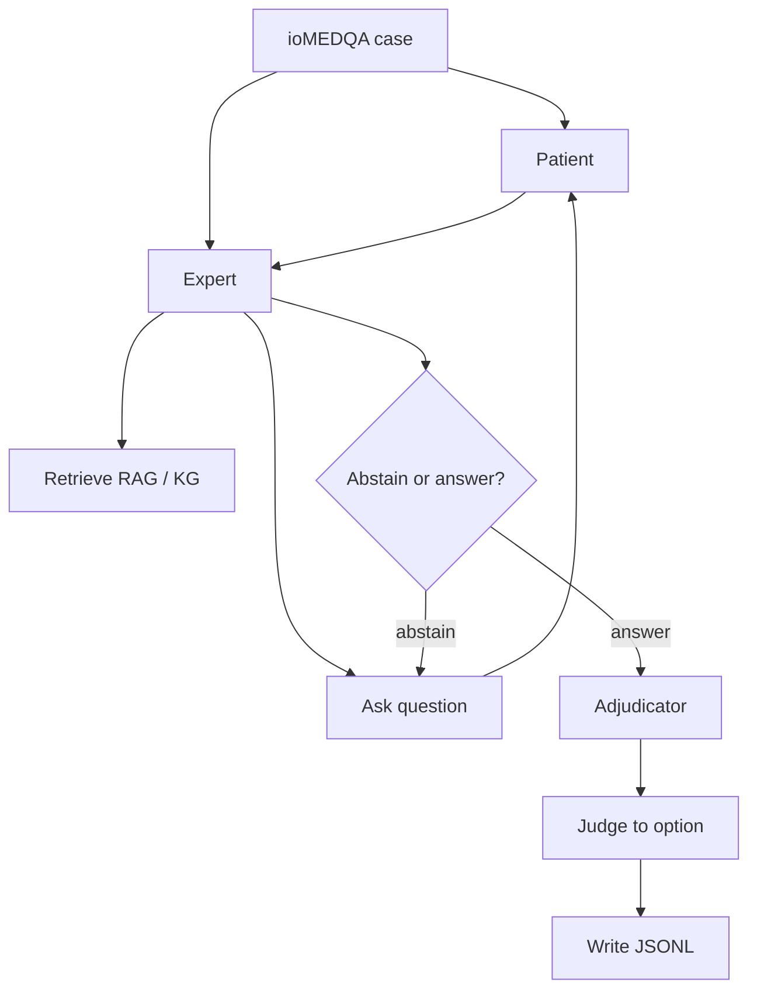

# KnowGuard

Interactive clinical QA based on the KnowGuard paper (ICLR 2026).

- **Paper:** [arXiv:2509.24816](https://arxiv.org/abs/2509.24816)
- **Upstream:** [IcecreamArtist/KnowGuard](https://github.com/IcecreamArtist/KnowGuard)

This repo is a runnable fork with local models, NVIDIA NIM, public knowledge graphs, clinical RAG, and evaluation scripts for **ioMEDQA** (1272 cases).

---

## Contents

1. [Overview](#1-overview)
2. [Paper reference numbers](#2-paper-reference-numbers)
3. [Results](#3-results)
4. [Code changes in this fork](#4-code-changes-in-this-fork)
5. [Run history](#5-run-history)
6. [Models](#6-models)
7. [Datasets](#7-datasets)
8. [Knowledge graph and RAG](#8-knowledge-graph-and-rag)
9. [Repo layout](#9-repo-layout)
10. [How the system works](#10-how-the-system-works)
11. [Modules](#11-modules)
12. [How to run](#12-how-to-run)
13. [API rate limits](#13-api-rate-limits)
14. [Limitations](#14-limitations)
15. [Citation](#15-citation)

---

## 1. Overview

KnowGuard asks clarifying questions before answering. The model starts with age, gender, and chief complaint only. It retrieves knowledge, may abstain, then maps a free-text answer to options A–D.

This fork adds:

- PrimeKG + Hetionet knowledge graph with FAISS
- Clinical / MedQA passage RAG
- Protocol settings (`min_questions`, higher KG threshold)
- Optional extras: discriminative questions, entropy gate, phase routing, adjudicator, dual-process, council
- Eval runners for NVIDIA NIM (and other OpenAI-compatible APIs)

---

## 2. Paper reference numbers

Numbers from the KnowGuard paper (GPT-4 + WHO KG), for context only:

| Method | ACC | Avg turns |
|--------|----:|----------:|
| KnowGuard basic | 70.98% | ~5.4–5.7 |
| KnowGuard enhanced | 74.12% | — |
| OpenEnded Scale | ~64.23% | ~5.15 |

Interactive ioMEDQA is harder than closed-book MedQA.

---

## 3. Results

### 3.1 NIM stack on ioMEDQA (partial; mixed providers in later cases)

Snapshot around 2026-09-04/05. Full N=1272 was still running. Later cases may include OpenRouter / Gemini as well as Nemotron Ultra — see notes.

| Split | N | ACC | Avg turns |
|-------|--:|----:|----------:|
| Merged | 587 | 71.38% | 7.35 |
| Shard 0 | 104 | 83.65% | 7.57 |
| Shard 1 | 138 | 71.01% | 7.43 |
| Shard 2 | 194 | 68.56% | 7.41 |
| Shard 3 | 148 | 66.89% | 7.04 |

Files:

- `results/KnowGuardExpert_astar_lite_nim_ioMEDQA_shard{0..3}.jsonl`
- `results/KnowGuardExpert_astar_lite_nim_ioMEDQA_merged.jsonl`
- `results/KnowGuardExpert_astar_lite_nim_ioMEDQA_merged_metrics.json`
- Mixed-provider copies also under `results/archive_mixed_*/` after the Ultra-only restart

Typical flags for that run:

```text
--use_discriminative_questions --use_entropy_gate --use_adjudicator
--use_clinical_rag --phase_routing --no_dual_process --no_council
--self_consistency 1 --min_questions 3 --kg_threshold 4.0
```

### 3.2 Smoke (Nemotron Ultra)

| Run | N | ACC | Avg turns |
|-----|--:|----:|----------:|
| Smoke-20 | 20 | 70.0% | 6.45 |

### 3.3 Local models (full N=1272)

Weaker open models; not comparable to the paper’s GPT-4 setup.

| Method | Model | N | ACC | Avg turns |
|--------|-------|--:|----:|----------:|
| KnowGuardExpert | Qwen2.5-1.5B | 1272 | 27.5% | 0.45 |
| KnowGuardExpert | Mistral-7B | 1272 | 32.5% | 0.19 |
| KnowGuardExpert | Llama-3.1-8B | 1272 | 34.9% | 0.92 |
| OpenEndedScaleExpert | Mistral-7B | 1272 | 33.6% | 2.08 |
| OpenEndedScaleExpert | Llama-3.1-8B | 1272 | 37.0% | 4.04 |
| OpenEndedNumericalCutOff | local | 1272 | 28.3% | 12.0 |

### 3.4 Other smoke

| Run | N | ACC | Turns |
|-----|--:|----:|------:|
| Llama-3.1-8B local stack | 50 | 36.0% | 0.14 |

---

## 4. Code changes in this fork

| Component | Files | Role |
|-----------|-------|------|
| FAISS cache | `know_storage.py`, `clinical_rag.py` | Faster KG init |
| Progressive patient | `patient.py` | Fact unlock by keywords |
| Discriminative questions | `expert_functions.py` | Narrow the differential |
| Entropy gate | `adjudicator.py`, `expert.py` | Delay commit when uncertain |
| Phase routing | `expert.py` | RAG early, KG later |
| Clinical RAG | `clinical_rag.py` | Passage retrieval |
| Adjudicator | `adjudicator.py` | Check before final answer |
| Dual-process | `dual_process.py` | Optional critic |
| Council | `council.py` | Optional multi-model vote |
| API helper | `helper.py` | Providers, retries, NIM spacing |
| Runners | `scripts/*.sh` | Smoke, shards, resume |

---

## 5. Run history

1. Local full evals (Qwen / Mistral / Llama) on ioMEDQA.
2. Built PrimeKG + Hetionet CSV and FAISS.
3. Raised `min_questions` / `kg_threshold` so the model asks before answering.
4. Added clinical RAG and adjudicator.
5. Added optional question / abstention helpers above.
6. Ran Nemotron Ultra smoke-20 (~70%).
7. Started full 4-shard Ultra run; hit NIM 429/503; resumed from JSONL.
8. Temporarily used OpenRouter free / Gemini to keep shards moving (mixed models).
9. Restarted toward **Nemotron Ultra only**, one worker at a time (`scripts/run_ultra_only_serial.sh`).

---

## 6. Models

| Model | Provider | Notes |
|-------|----------|-------|
| `nvidia/nemotron-3-ultra-550b-a55b` | NVIDIA NIM | Main API model |
| `nvidia/nemotron-3-super-120b-a12b:free` | OpenRouter | Used briefly for throughput |
| `gemini-flash-lite-latest` | Google | Used briefly for throughput |
| Llama-3.1-8B / Mistral-7B / Qwen-1.5B | Local GPU | Earlier full baselines |

API keys go in `.env` (gitignored). See `.env.example`.

---

## 7. Datasets

| Dataset | Path | N |
|---------|------|--:|
| ioMEDQA full | `data/interactive/ioMEDQA.jsonl` | 1272 |
| Smoke sets | `data/interactive/ioMEDQA_smoke*.jsonl` | 1–50 |
| Shards | `data/interactive/shards/ioMEDQA_shard{0..3}.jsonl` | 318 each |

Build helper: `scripts/build_datasets.py`.

ioCRAFT-MD / AfriMedQA are not used here yet.

---

## 8. Knowledge graph and RAG

| Path | Notes |
|------|-------|
| `data/kg/combined_primekg_hetionet.csv` | Merged clinical edges (~54 MB) |
| `data/kg/combined_kg_meta.json` | Build metadata |
| `data/kg/faiss_db_combined/` | FAISS index (~746 MB, not in git) |
| `data/kg/baseline_dataset/Disease2demo.csv` | Demographics |
| `data/kg/WHO/overview.json` | Text overview stubs |
| `data/kg/clinical_corpus/` | RAG passages |

```bash
bash scripts/build_strong_kg.sh   # rebuild FAISS if missing
```

---

## 9. Repo layout

```
KnowGuard/
├── Open_benchmark.py      # Eval loop
├── args.py
├── expert.py / expert_functions.py / expert_basics.py
├── patient.py
├── know_storage.py / graph_reason.py / clinical_rag.py
├── adjudicator.py / dual_process.py / council.py
├── helper.py / prompts.py / LLM_judge.py / LLM_score.py
├── data/interactive/      # ioMEDQA
├── data/kg/               # KG + RAG
├── results/               # Predictions and metrics
├── scripts/               # Build and eval
└── README.md
```

---

## 10. How the system works



1. Expert sees sparse initial info.  
2. Retrieves RAG / KG.  
3. Asks questions; patient reveals facts.  
4. Abstains until gates pass.  
5. Judge maps answer to A/B/C/D.  
6. Result appended to JSONL (resume by case id).

---

## 11. Modules

| Module | Role |
|--------|------|
| `Open_benchmark.py` | Case loop and resume |
| `KnowGuardExpert` | Ask / retrieve / abstain / answer |
| `FactSelectPatient` | Simulated patient |
| `know_storage.py` | KG + FAISS |
| `helper.py` | LLM API calls |
| `scripts/compute_metrics.py` | ACC, turns, ECE, Brier |
| `scripts/run_ultra_only_serial.sh` | One Ultra worker at a time |
| `scripts/run_full_resume_nim_only.sh` | Ultra resume (multi-shard) |

---

## 12. How to run

```bash
cd KnowGuard
python -m venv .venv && source .venv/bin/activate
pip install -r requirements.txt
cp .env.example .env   # set NVIDIA_API_KEY
```

Nemotron Ultra only (one shard at a time):

```bash
bash scripts/run_ultra_only_serial.sh
# log: logs/ultra_only_serial.log
# out: results/KnowGuardExpert_astar_ultra_only_ioMEDQA_shard*.jsonl
```

Metrics:

```bash
python scripts/compute_metrics.py results/KnowGuardExpert_astar_ultra_only_ioMEDQA_merged.jsonl \
  --output results/KnowGuardExpert_astar_ultra_only_ioMEDQA_merged_metrics.json
```

---

## 13. API rate limits

| Issue | What we did |
|-------|-------------|
| NIM 429 / 503 | Fewer workers, longer retries, request spacing |
| Gemini free quota | Avoided for clean Ultra runs |
| OpenRouter credits | Free `:free` models only when needed |
| Crash mid-run | Resume skips finished case ids |

---

## 14. Limitations

- Full N=1272 Ultra-only run may still be in progress.
- Some archived results mix providers; treat Ultra-only outputs as the clean set.
- Paper WHO multimodal KG is not public; this repo uses PrimeKG + Hetionet + clinical RAG.
- Local 7B/8B numbers are much lower than GPT-4 paper numbers.

---

## 15. Citation

```bibtex
@inproceedings{knowguard2026,
  title={KnowGuard: Knowledge-Driven Abstention for Multi-Round Clinical Reasoning},
  author={/* see arXiv:2509.24816 */},
  booktitle={ICLR},
  year={2026}
}
```
